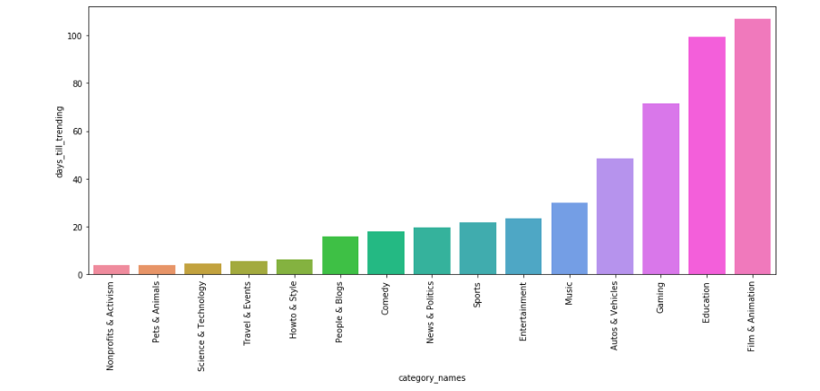

# Projects

----
----

## Toxic Comment Detection using Deep Learning

### Description - [code](https://github.com/AndersonReyes/toxic-comment-classification-using-lstm)
Multilabel comment detection using deep learning and evaluating performance on CNN, LSTM, and a combination of
the previous two called C-LSTM. This is my senior project so it's still ongoing. The project is from the [kaggle](
https://www.kaggle.com/c/jigsaw-toxic-comment-classification-challenge) competition.

----
----

## YouTube trending analysis

### Description - [code](https://github.com/AndersonReyes/YoutubeTrendingAnalysis)
Exploratory data analysis of YouTube trending videos.The [data](https://www.kaggle.com/datasnaek/youtube-new/data)
is from 11/17/17 to 12/14/17. The goal was to see if we can find interesting properties of YouTube trending videos.
I also used a one class support vector machine to try and predict whether a video will trend or not.

----
----

## Deep learning for facial emotion recognition

### Description - [code](https://github.com/AndersonReyes/FacialExpressionRecognition)
Exploratory data analysis of YouTube trending videos.
The [data](https://www.kaggle.com/c/challenges-in-representation-learning-facial-expression-recognition-challenge
) came with 6 emotions: fear, happy, surprise, angry, disgust, sad, neutral. I used a convolutional neural network
to try and detect the emotions. The network only got about 55%. In this case the bottleneck could be data or the network was too small but I don't have more computational power to make the network bigger.

----
----

